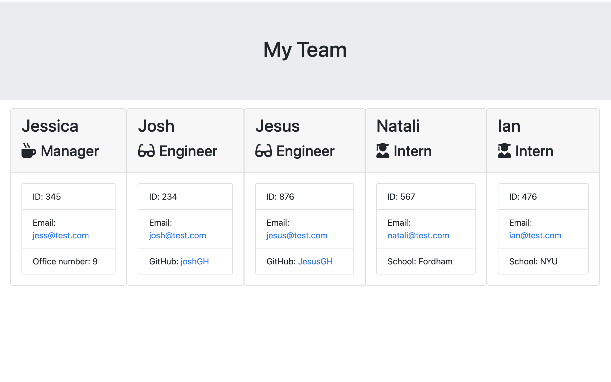

# Team Profile Generator
This application allows the user to generate a team profile using the CLI. The app is meant to allow managers to create a simple page with their team information, allowing them to easily access useful information such as their GitHub links and employee IDs. 

## Technology

The website was built using HTML, CSS and Javascript, and several Node packages (FS and Inquirer).

## Pages

Single responsive page containing the generated template.

Link to demo (you might need to be logged into Gmail to view) https://drive.google.com/drive/folders/15rlk2ZKfxwTe5SgE6vr7yJuamvaqpn22 

## Contributing

Pull requests are welcome, but should be limited to improving the layout and styles. No special software is required to clone and run the website other than a basic code editor and a browser of choice. 

## License

MIT
